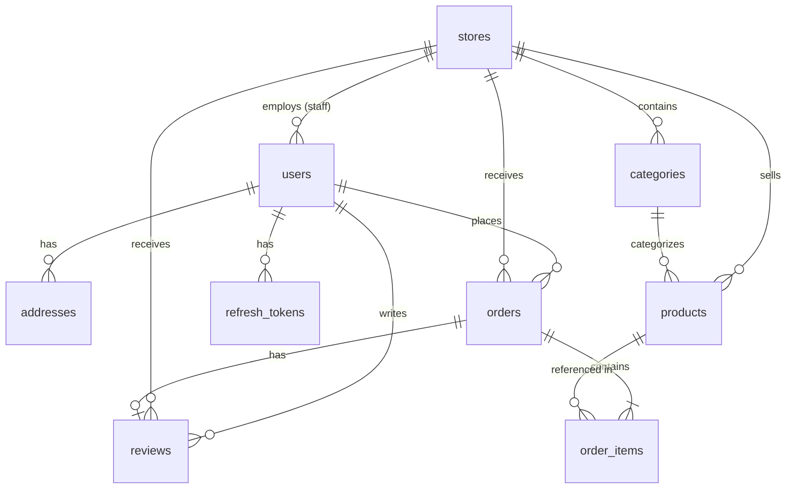

# PostgreSQL Database Schema Definitions & Types

This document defines the SQL schema structure, table definitions, data types, relationships, and constraints for each table in the Drink Ordering System PostgreSQL database.

---

## 1. Entity Relationship (ER) Diagram



---

## 2. Table Definitions & DDL

Below is the PostgreSQL DDL (Data Definition Language) script defining all tables, constraints, and indexes.

```sql
-- Enable UUID extension if not already enabled
CREATE EXTENSION IF NOT EXISTS "uuid-ossp";

-- 1. STORES TABLE
CREATE TABLE stores (
    id UUID PRIMARY KEY DEFAULT uuid_generate_v4(),
    name VARCHAR(100) NOT NULL,
    phone VARCHAR(20) NOT NULL,
    address TEXT NOT NULL,
    is_open BOOLEAN NOT NULL DEFAULT TRUE,
    is_locked BOOLEAN NOT NULL DEFAULT FALSE,
    rating_avg NUMERIC(3, 2) NOT NULL DEFAULT 0.00,
    rating_count INTEGER NOT NULL DEFAULT 0,
    created_at TIMESTAMP WITH TIME ZONE NOT NULL DEFAULT CURRENT_TIMESTAMP,
    updated_at TIMESTAMP WITH TIME ZONE NOT NULL DEFAULT CURRENT_TIMESTAMP
);

-- 2. USERS TABLE
CREATE TABLE users (
    id UUID PRIMARY KEY DEFAULT uuid_generate_v4(),
    email VARCHAR(255) UNIQUE NOT NULL,
    password_hash VARCHAR(255) NOT NULL,
    role VARCHAR(20) NOT NULL CHECK (role IN ('customer', 'staff', 'admin')),
    store_id UUID REFERENCES stores(id) ON DELETE SET NULL,
    full_name VARCHAR(100) NOT NULL,
    avatar_url VARCHAR(255),
    dob DATE,
    gender VARCHAR(10) CHECK (gender IN ('male', 'female', 'other')),
    is_banned BOOLEAN NOT NULL DEFAULT FALSE,
    created_at TIMESTAMP WITH TIME ZONE NOT NULL DEFAULT CURRENT_TIMESTAMP,
    updated_at TIMESTAMP WITH TIME ZONE NOT NULL DEFAULT CURRENT_TIMESTAMP
);

-- 3. ADDRESSES TABLE (Separate relation instead of embedded array)
CREATE TABLE addresses (
    id UUID PRIMARY KEY DEFAULT uuid_generate_v4(),
    user_id UUID NOT NULL REFERENCES users(id) ON DELETE CASCADE,
    receiver_name VARCHAR(100) NOT NULL,
    receiver_phone VARCHAR(20) NOT NULL,
    address_line TEXT NOT NULL,
    is_default BOOLEAN NOT NULL DEFAULT FALSE,
    created_at TIMESTAMP WITH TIME ZONE NOT NULL DEFAULT CURRENT_TIMESTAMP,
    updated_at TIMESTAMP WITH TIME ZONE NOT NULL DEFAULT CURRENT_TIMESTAMP
);

-- 4. CATEGORIES TABLE
CREATE TABLE categories (
    id UUID PRIMARY KEY DEFAULT uuid_generate_v4(),
    store_id UUID NOT NULL REFERENCES stores(id) ON DELETE CASCADE,
    name VARCHAR(100) NOT NULL,
    created_at TIMESTAMP WITH TIME ZONE NOT NULL DEFAULT CURRENT_TIMESTAMP,
    updated_at TIMESTAMP WITH TIME ZONE NOT NULL DEFAULT CURRENT_TIMESTAMP
);

-- 5. PRODUCTS TABLE
CREATE TABLE products (
    id UUID PRIMARY KEY DEFAULT uuid_generate_v4(),
    store_id UUID NOT NULL REFERENCES stores(id) ON DELETE CASCADE,
    category_id UUID NOT NULL REFERENCES categories(id) ON DELETE RESTRICT,
    name VARCHAR(100) NOT NULL,
    description TEXT,
    price NUMERIC(12, 2) NOT NULL CHECK (price >= 0.00),
    image_url VARCHAR(255),
    status VARCHAR(20) NOT NULL DEFAULT 'active' CHECK (status IN ('active', 'hidden', 'out_of_stock')),
    created_at TIMESTAMP WITH TIME ZONE NOT NULL DEFAULT CURRENT_TIMESTAMP,
    updated_at TIMESTAMP WITH TIME ZONE NOT NULL DEFAULT CURRENT_TIMESTAMP
);

-- 6. ORDERS TABLE
CREATE TABLE orders (
    id UUID PRIMARY KEY DEFAULT uuid_generate_v4(),
    order_code VARCHAR(10) UNIQUE NOT NULL,
    customer_id UUID NOT NULL REFERENCES users(id) ON DELETE RESTRICT,
    store_id UUID NOT NULL REFERENCES stores(id) ON DELETE RESTRICT,
    receiver_name VARCHAR(100) NOT NULL,
    receiver_phone VARCHAR(20) NOT NULL,
    delivery_address TEXT NOT NULL,
    subtotal NUMERIC(12, 2) NOT NULL CHECK (subtotal >= 0.00),
    total_amount NUMERIC(12, 2) NOT NULL CHECK (total_amount >= 0.00),
    payment_method VARCHAR(20) NOT NULL DEFAULT 'COD' CHECK (payment_method IN ('COD')),
    status VARCHAR(20) NOT NULL DEFAULT 'pending' CHECK (status IN ('pending', 'preparing', 'completed', 'cancelled')),
    cancel_reason TEXT,
    created_at TIMESTAMP WITH TIME ZONE NOT NULL DEFAULT CURRENT_TIMESTAMP,
    updated_at TIMESTAMP WITH TIME ZONE NOT NULL DEFAULT CURRENT_TIMESTAMP
);

-- 7. ORDER_ITEMS TABLE
CREATE TABLE order_items (
    id UUID PRIMARY KEY DEFAULT uuid_generate_v4(),
    order_id UUID NOT NULL REFERENCES orders(id) ON DELETE CASCADE,
    product_id UUID NOT NULL REFERENCES products(id) ON DELETE RESTRICT,
    product_name VARCHAR(100) NOT NULL, -- Historical snapshot
    price NUMERIC(12, 2) NOT NULL CHECK (price >= 0.00), -- Historical snapshot
    quantity INTEGER NOT NULL CHECK (quantity > 0),
    line_total NUMERIC(12, 2) NOT NULL CHECK (line_total >= 0.00),
    created_at TIMESTAMP WITH TIME ZONE NOT NULL DEFAULT CURRENT_TIMESTAMP
);

-- 8. REVIEWS TABLE
CREATE TABLE reviews (
    id UUID PRIMARY KEY DEFAULT uuid_generate_v4(),
    order_id UUID UNIQUE NOT NULL REFERENCES orders(id) ON DELETE CASCADE,
    customer_id UUID NOT NULL REFERENCES users(id) ON DELETE RESTRICT,
    store_id UUID NOT NULL REFERENCES stores(id) ON DELETE CASCADE,
    stars INTEGER NOT NULL CHECK (stars BETWEEN 1 AND 5),
    comment TEXT NOT NULL,
    created_at TIMESTAMP WITH TIME ZONE NOT NULL DEFAULT CURRENT_TIMESTAMP
);

-- 9. REFRESH TOKENS TABLE
CREATE TABLE refresh_tokens (
    id UUID PRIMARY KEY DEFAULT uuid_generate_v4(),
    user_id UUID NOT NULL REFERENCES users(id) ON DELETE CASCADE,
    token_hash VARCHAR(255) UNIQUE NOT NULL,
    is_revoked BOOLEAN NOT NULL DEFAULT FALSE,
    expires_at TIMESTAMP WITH TIME ZONE NOT NULL,
    created_at TIMESTAMP WITH TIME ZONE NOT NULL DEFAULT CURRENT_TIMESTAMP
);

-- --- INDEXES FOR OPTIMIZATION ---
CREATE INDEX idx_users_email ON users(email);
CREATE INDEX idx_users_store_id ON users(store_id) WHERE store_id IS NOT NULL;
CREATE INDEX idx_addresses_user_id ON addresses(user_id);
CREATE INDEX idx_categories_store_id ON categories(store_id);
CREATE INDEX idx_products_store_status ON products(store_id, status);
CREATE INDEX idx_products_category ON products(category_id);
CREATE INDEX idx_products_name ON products(name);
CREATE INDEX idx_orders_customer_id ON orders(customer_id);
CREATE INDEX idx_orders_store_status ON orders(store_id, status);
CREATE INDEX idx_orders_order_code ON orders(order_code);
CREATE INDEX idx_order_items_order_id ON order_items(order_id);
CREATE INDEX idx_reviews_store ON reviews(store_id);
CREATE INDEX idx_refresh_tokens_hash ON refresh_tokens(token_hash);
```

---

## 3. Table Schemas & Column Descriptions

### 3.1 `stores`
Stores represent beverage shop profiles.

| Column Name | Data Type | Constraints | Description |
|---|---|---|---|
| `id` | `UUID` | PRIMARY KEY | Unique store identifier |
| `name` | `VARCHAR(100)` | NOT NULL | Store business name |
| `phone` | `VARCHAR(20)` | NOT NULL | Customer support phone number |
| `address` | `TEXT` | NOT NULL | Physical location of the store |
| `is_open` | `BOOLEAN` | NOT NULL, DEFAULT `true` | Toggle indicating if store is currently accepting orders |
| `is_locked` | `BOOLEAN` | NOT NULL, DEFAULT `false` | Admin-managed lockout status (locked store cannot accept orders or show up) |
| `rating_avg` | `NUMERIC(3, 2)` | NOT NULL, DEFAULT `0.00` | Cached average ratings score (computed periodically/on-demand) |
| `rating_count`| `INTEGER` | NOT NULL, DEFAULT `0` | Cached total count of ratings received |
| `created_at` | `TIMESTAMP WITH TZ`| NOT NULL, DEFAULT `NOW()` | Store creation timestamp |
| `updated_at` | `TIMESTAMP WITH TZ`| NOT NULL, DEFAULT `NOW()` | Store profile last updated timestamp |

---

### 3.2 `users`
Contains all user accounts including Customer, Staff, and Admin roles.

| Column Name | Data Type | Constraints | Description |
|---|---|---|---|
| `id` | `UUID` | PRIMARY KEY | Unique user identifier |
| `email` | `VARCHAR(255)` | UNIQUE, NOT NULL | Primary email address (used for login) |
| `password_hash`| `VARCHAR(255)` | NOT NULL | Bcrypt-hashed password |
| `role` | `VARCHAR(20)` | CHECK enum, NOT NULL | Role of user: `'customer'`, `'staff'`, or `'admin'` |
| `store_id` | `UUID` | FOREIGN KEY -> `stores`, Nullable | Assigned store ID for users with `staff` role |
| `full_name` | `VARCHAR(100)` | NOT NULL | Display name of the user |
| `avatar_url` | `VARCHAR(255)` | Nullable | Uploaded profile avatar image path |
| `dob` | `DATE` | Nullable | User date of birth |
| `gender` | `VARCHAR(10)` | CHECK enum, Nullable | Identity: `'male'`, `'female'`, or `'other'` |
| `is_banned` | `BOOLEAN` | NOT NULL, DEFAULT `false` | Lockout state (banned users cannot authenticate or act) |
| `created_at` | `TIMESTAMP WITH TZ`| NOT NULL, DEFAULT `NOW()` | Account signup timestamp |
| `updated_at` | `TIMESTAMP WITH TZ`| NOT NULL, DEFAULT `NOW()` | Account update timestamp |

---

### 3.3 `addresses`
Delivery addresses managed by Customer users.

| Column Name | Data Type | Constraints | Description |
|---|---|---|---|
| `id` | `UUID` | PRIMARY KEY | Unique address identifier |
| `user_id` | `UUID` | FOREIGN KEY -> `users` ON DELETE CASCADE | Associated customer user |
| `receiver_name`| `VARCHAR(100)`| NOT NULL | Designated receiver's full name |
| `receiver_phone`| `VARCHAR(20)`| NOT NULL | Designated contact number |
| `address_line`| `TEXT` | NOT NULL | Full textual delivery location |
| `is_default` | `BOOLEAN` | NOT NULL, DEFAULT `false` | Default selected delivery address flags |
| `created_at` | `TIMESTAMP WITH TZ`| NOT NULL, DEFAULT `NOW()` | Creation timestamp |
| `updated_at` | `TIMESTAMP WITH TZ`| NOT NULL, DEFAULT `NOW()` | Last modified timestamp |

---

### 3.4 `categories`
Categories used by stores to classify menu products.

| Column Name | Data Type | Constraints | Description |
|---|---|---|---|
| `id` | `UUID` | PRIMARY KEY | Unique category identifier |
| `store_id` | `UUID` | FOREIGN KEY -> `stores` ON DELETE CASCADE | Store owning the category |
| `name` | `VARCHAR(100)` | NOT NULL | Category display title |
| `created_at` | `TIMESTAMP WITH TZ`| NOT NULL, DEFAULT `NOW()` | Creation timestamp |
| `updated_at` | `TIMESTAMP WITH TZ`| NOT NULL, DEFAULT `NOW()` | Update timestamp |

---

### 3.5 `products`
The menu items listed by stores.

| Column Name | Data Type | Constraints | Description |
|---|---|---|---|
| `id` | `UUID` | PRIMARY KEY | Unique product identifier |
| `store_id` | `UUID` | FOREIGN KEY -> `stores` ON DELETE CASCADE | Owner store |
| `category_id` | `UUID` | FOREIGN KEY -> `categories` ON DELETE RESTRICT | Category folder |
| `name` | `VARCHAR(100)` | NOT NULL | Product name |
| `description` | `TEXT` | Nullable | Detail summary of ingredients, contents, size details |
| `price` | `NUMERIC(12, 2)`| NOT NULL, CHECK (price >= 0.00) | Item price |
| `image_url` | `VARCHAR(255)` | Nullable | Local uploads directory file path |
| `status` | `VARCHAR(20)` | CHECK enum, DEFAULT `'active'` | Display status: `'active'`, `'hidden'`, or `'out_of_stock'` |
| `created_at` | `TIMESTAMP WITH TZ`| NOT NULL, DEFAULT `NOW()` | Product added timestamp |
| `updated_at` | `TIMESTAMP WITH TZ`| NOT NULL, DEFAULT `NOW()` | Product configuration last changed |

---

### 3.6 `orders`
The checkout order transaction record.

| Column Name | Data Type | Constraints | Description |
|---|---|---|---|
| `id` | `UUID` | PRIMARY KEY | Unique order transaction identifier |
| `order_code` | `VARCHAR(10)` | UNIQUE, NOT NULL | Human-readable short reference string (e.g. "8H2F9D") |
| `customer_id` | `UUID` | FOREIGN KEY -> `users` ON DELETE RESTRICT | Purchasing Customer |
| `store_id` | `UUID` | FOREIGN KEY -> `stores` ON DELETE RESTRICT | Fulfilling Store |
| `receiver_name`| `VARCHAR(100)`| NOT NULL | Delivery receiver name snapshot |
| `receiver_phone`| `VARCHAR(20)`| NOT NULL | Delivery receiver contact snapshot |
| `delivery_address`| `TEXT` | NOT NULL | Delivery location snapshot |
| `subtotal` | `NUMERIC(12, 2)`| NOT NULL, CHECK >= 0.00 | Total value of order items before any fees |
| `total_amount`| `NUMERIC(12, 2)`| NOT NULL, CHECK >= 0.00 | Final checkout total paid by customer |
| `payment_method`| `VARCHAR(20)` | CHECK enum, DEFAULT `'COD'` | Supported payment methods (COD only in MVP) |
| `status` | `VARCHAR(20)` | CHECK enum, DEFAULT `'pending'` | Lifecycle state: `'pending'`, `'preparing'`, `'completed'`, `'cancelled'` |
| `cancel_reason`| `TEXT` | Nullable | Cancellation reason description |
| `created_at` | `TIMESTAMP WITH TZ`| NOT NULL, DEFAULT `NOW()` | Checkout submission timestamp |
| `updated_at` | `TIMESTAMP WITH TZ`| NOT NULL, DEFAULT `NOW()` | Last state modification timestamp |

---

### 3.7 `order_items`
Snapshot details of the products ordered in each order (prevents price or product configuration changes from modifying historical orders).

| Column Name | Data Type | Constraints | Description |
|---|---|---|---|
| `id` | `UUID` | PRIMARY KEY | Unique row item identifier |
| `order_id` | `UUID` | FOREIGN KEY -> `orders` ON DELETE CASCADE | Associated order |
| `product_id` | `UUID` | FOREIGN KEY -> `products` ON DELETE RESTRICT | Reference to source product |
| `product_name` | `VARCHAR(100)` | NOT NULL | Historical snapshot of the product name |
| `price` | `NUMERIC(12, 2)`| NOT NULL, CHECK >= 0.00 | Historical snapshot of the price per unit |
| `quantity` | `INTEGER` | NOT NULL, CHECK (quantity > 0) | Ordered quantity |
| `line_total` | `NUMERIC(12, 2)`| NOT NULL, CHECK >= 0.00 | Computed row total (`price * quantity`) |
| `created_at` | `TIMESTAMP WITH TZ`| NOT NULL, DEFAULT `NOW()` | Creation timestamp |

---

### 3.8 `reviews`
Review rating submitted by customers for completed orders.

| Column Name | Data Type | Constraints | Description |
|---|---|---|---|
| `id` | `UUID` | PRIMARY KEY | Unique review identifier |
| `order_id` | `UUID` | UNIQUE, FOREIGN KEY -> `orders` ON DELETE CASCADE| Rated order (max 1 review per order) |
| `customer_id` | `UUID` | FOREIGN KEY -> `users` ON DELETE RESTRICT | Author customer |
| `store_id` | `UUID` | FOREIGN KEY -> `stores` ON DELETE CASCADE | Targeted store |
| `stars` | `INTEGER` | CHECK (stars BETWEEN 1 AND 5) | Review rating score (1-5) |
| `comment` | `TEXT` | NOT NULL | Customer text comment |
| `created_at` | `TIMESTAMP WITH TZ`| NOT NULL, DEFAULT `NOW()` | Review submitted timestamp |

---

### 3.9 `refresh_tokens`
Houses database-stored hashes of JWT refresh tokens to support revoking and secure logouts.

| Column Name | Data Type | Constraints | Description |
|---|---|---|---|
| `id` | `UUID` | PRIMARY KEY | Unique record identifier |
| `user_id` | `UUID` | FOREIGN KEY -> `users` ON DELETE CASCADE | User owner of token |
| `token_hash` | `VARCHAR(255)` | UNIQUE, NOT NULL | Hashed refresh token value |
| `is_revoked` | `BOOLEAN` | NOT NULL, DEFAULT `false` | Boolean indicating if token has been explicitly invalidated |
| `expires_at` | `TIMESTAMP WITH TZ`| NOT NULL | Expiration date boundary |
| `created_at` | `TIMESTAMP WITH TZ`| NOT NULL, DEFAULT `NOW()` | Token generated timestamp |
